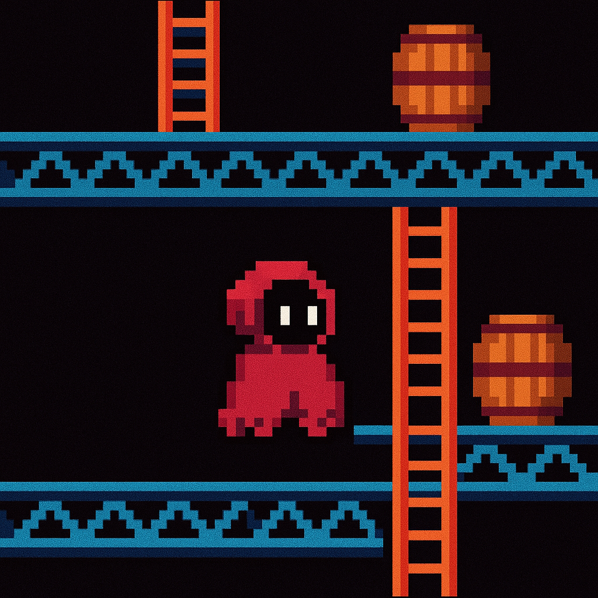

# Donkey Kong Classic Game



[Español](#español) | [English](#english)

## English

### 🎮 Game Overview

A classic Donkey Kong-style platformer game developed in Python with Pygame, featuring AI-powered enemies using Q-Learning algorithms and cloud data persistence with Firebase.

### ✨ Features

- 🎮 Classic platformer mechanics
- 🤖 AI enemies with Q-Learning behavior
- ☁️ Cloud data persistence with Firebase
- 🎯 Scoring and lives system
- 🏪 In-game shop with upgrades
- 📱 Executable packaging ready
- 🎨 Animated sprites and visual effects
- 🔊 Sound system integration

### 🛠️ Technologies Used

- **Python 3.12+** - Main programming language
- **Pygame 2.5.2** - Game development framework
- **Firebase** - Cloud database and authentication
- **NumPy** - Numerical computations for AI
- **Matplotlib** - Data visualization for AI training
- **PyInstaller** - Executable packaging
- **Q-Learning** - Reinforcement learning algorithm

### 🚀 Quick Start

1. **Clone the repository**
```bash
git clone https://github.com/Dylalva/ClassicGame.git
cd ClassicGame
```

2. **Install dependencies**
```bash
pip install -r requirements.txt
```

3. **Configure Firebase** (see [docs/firebase-setup.md](docs/firebase-setup.md))
```bash
cp .env.example .env
```

4. **Run the game**
```bash
python main.py
```

### 🎯 Game Controls

- **Arrow Keys/WASD**: Movement
- **Space/W**: Jump
- **T**: Open shop
- **F**: Throw banana (if available)
- **Mouse Click**: Aim and throw banana
- **ESC**: Pause game

### 📁 Project Structure

```
ClassicGame/
├── main.py                 # Entry point
├── requirements.txt        # Dependencies
├── .env                   # Environment variables
├── build.py               # Packaging script
├── src/
│   ├── game/              # Core game logic
│   ├── entities/          # Player and enemies
│   ├── managers/          # Game systems managers
│   ├── ai/                # AI algorithms
│   ├── ui/                # User interface
│   └── utils/             # Utilities and configuration
├── assets/                # Graphics and sound resources
├── data/                  # Persistent data and models
├── docs/                  # Complete documentation
└── tests/                 # Unit tests
```

### 🤖 AI Features

- **Q-Learning Algorithm**: Enemies learn player behavior
- **Dynamic Difficulty**: AI adapts to player skill
- **Smart Navigation**: Enemies navigate between platforms
- **Behavioral Patterns**: Different enemy types with unique AI

### 📚 Documentation

Complete documentation available in the [docs/](docs/) folder:

- [Firebase Setup Guide](docs/firebase-setup.md)
- [AI Algorithms Explanation](docs/ai-algorithms.md)
- [Game Architecture](docs/architecture.md)
- [Development Guide](docs/development.md)

### 🏗️ Building Executable

```bash
python build.py
```

The executable will be generated in the `dist/` folder.

### 🤝 Contributing

1. Fork the project
2. Create a feature branch
3. Commit your changes
4. Push to the branch
5. Open a Pull Request

### 📄 License

This project is licensed under the MIT License.

---

<details>
## Español

### 🎮 Visión General del Juego

Un juego de plataformas clásico estilo Donkey Kong desarrollado en Python con Pygame, que incluye enemigos con inteligencia artificial usando algoritmos Q-Learning y persistencia de datos en la nube con Firebase.

### ✨ Características

- 🎮 Mecánicas clásicas de plataformas
- 🤖 Enemigos con IA usando Q-Learning
- ☁️ Persistencia de datos en la nube con Firebase
- 🎯 Sistema de puntuación y vidas
- 🏪 Tienda en el juego con mejoras
- 📱 Listo para empaquetado como ejecutable
- 🎨 Sprites animados y efectos visuales
- 🔊 Sistema de sonido integrado

### 🛠️ Tecnologías Utilizadas

- **Python 3.12+** - Lenguaje de programación principal
- **Pygame 2.5.2** - Framework de desarrollo de juegos
- **Firebase** - Base de datos en la nube y autenticación
- **NumPy** - Cálculos numéricos para IA
- **Matplotlib** - Visualización de datos para entrenamiento de IA
- **PyInstaller** - Empaquetado de ejecutables
- **Q-Learning** - Algoritmo de aprendizaje por refuerzo

### 🚀 Inicio Rápido

1. **Clonar el repositorio**
```bash
git clone https://github.com/Dylalva/ClassicGame.git
cd ClassicGame
```

2. **Instalar dependencias**
```bash
pip install -r requirements.txt
```

3. **Configurar Firebase** (ver [docs/firebase-setup.md](docs/firebase-setup.md))
```bash
cp .env.example .env
```

4. **Ejecutar el juego**
```bash
python main.py
```

### 🎯 Controles del Juego

- **Flechas/WASD**: Movimiento
- **Espacio/W**: Saltar
- **T**: Abrir tienda
- **F**: Lanzar banana (si está disponible)
- **Clic del Mouse**: Apuntar y lanzar banana
- **ESC**: Pausar juego

### 📁 Estructura del Proyecto

```
ClassicGame/
├── main.py                 # Punto de entrada
├── requirements.txt        # Dependencias
├── .env                   # Variables de entorno
├── build.py               # Script de empaquetado
├── src/
│   ├── game/              # Lógica principal del juego
│   ├── entities/          # Jugador y enemigos
│   ├── managers/          # Gestores de sistemas del juego
│   ├── ai/                # Algoritmos de IA
│   ├── ui/                # Interfaz de usuario
│   └── utils/             # Utilidades y configuración
├── assets/                # Recursos gráficos y sonoros
├── data/                  # Datos persistentes y modelos
├── docs/                  # Documentación completa
└── tests/                 # Pruebas unitarias
```

### 🤖 Características de IA

- **Algoritmo Q-Learning**: Los enemigos aprenden el comportamiento del jugador
- **Dificultad Dinámica**: La IA se adapta a la habilidad del jugador
- **Navegación Inteligente**: Los enemigos navegan entre plataformas
- **Patrones de Comportamiento**: Diferentes tipos de enemigos con IA única

### 📚 Documentación

Documentación completa disponible en la carpeta [docs/](docs/):

- [Guía de Configuración de Firebase](docs/firebase-setup.md)
- [Explicación de Algoritmos de IA](docs/ai-algorithms.md)
- [Arquitectura del Juego](docs/architecture.md)
- [Guía de Desarrollo](docs/development.md)

### 🏗️ Construir Ejecutable

```bash
python build.py
```

El ejecutable se generará en la carpeta `dist/`.

### 🤝 Contribuir

1. Fork el proyecto
2. Crea una rama para tu feature
3. Commit tus cambios
4. Push a la rama
5. Abre un Pull Request

### 📄 Licencia

Este proyecto está bajo la Licencia MIT.
